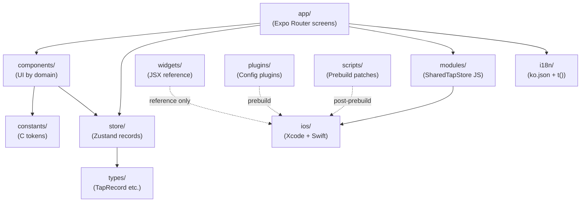
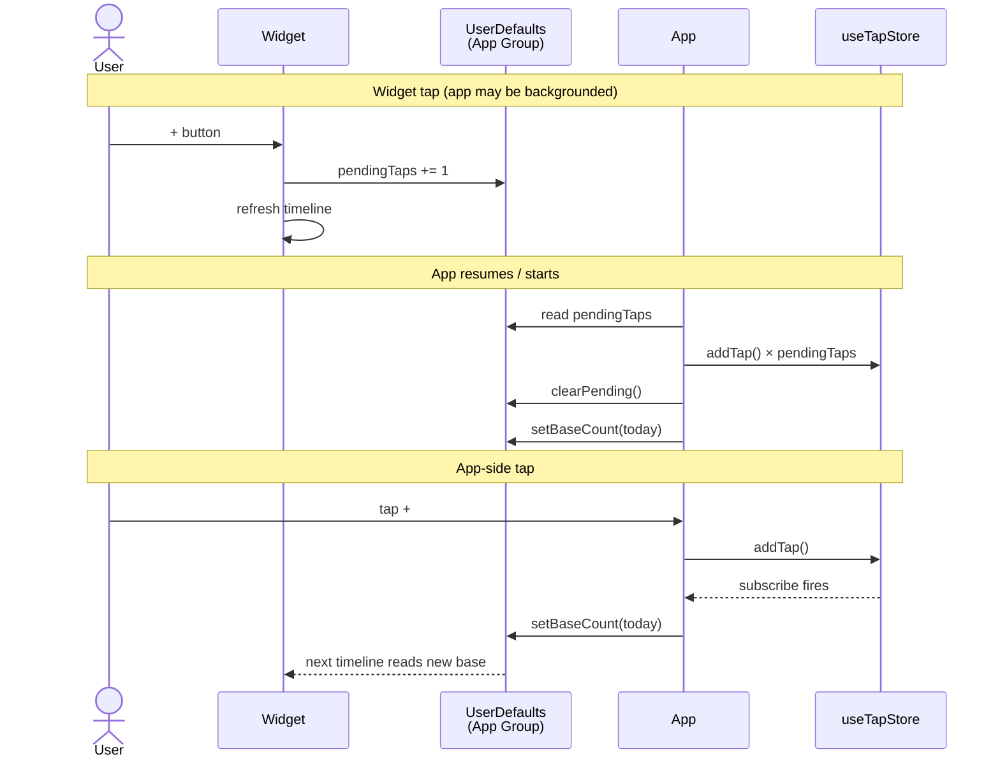

# Architecture

## Module dependency

## Single Source of Truth

`store/useTapStore.ts` holds `records: TapRecord[]`. All statistics — `getTodayCount`, `getDailyStats`, `getWeeklyStats` — are pure selectors over this array. Do not introduce parallel caches or counters.

## Widget ↔ App synchronization

Two integer keys in `UserDefaults` under App Group `group.com.example.smoketap`:

- `pendingTaps` — taps made via the widget that the app has not yet absorbed
- `baseTodayCount` — today's count as known by the app (display reference for the widget)

## Swift code generation surface

Three Swift code paths land in `ios/` at prebuild time:

<!-- skip-validate-next -->
| Output | Source | Trigger |
<!-- skip-validate-next -->
|--------|--------|---------|
<!-- skip-validate-next -->
| Main app modules (`SharedTapStoreMainApp.swift`, `SharedTapStoreModule.swift`) | `plugins/withSharedTapStore.js` | `expo prebuild` |
<!-- skip-validate-next -->
| Widget targets (`SharedTapStore.swift`, `RecordTapIntent.swift`, `SmokeTapWidget.swift`) | `scripts/patch-widget.js` (overwrites expo-widgets defaults) | After prebuild |
<!-- skip-validate-next -->
| Build phase order in `SmokeTap` target | `scripts/fix-build-phase-order.js` | After prebuild |
<!-- skip-validate-next -->
| `ExpoModulesProvider.swift` (regenerated each build) | `scripts/patch-expo-modules-provider.js` | Defensive: after prebuild + as Run Script Build Phase |

Why post-prebuild patches and ordering matter is in `MEMORY.md`.

## Design system

Single light theme — paper tone + ink. Tokens in `constants/colors.ts` (`C.BG`, `C.CARD`, `C.INK`). Hierarchy: numbers are the hero. The home circular display is the focal point. Decoration restraint applies — only render UI explicitly in the design spec.
