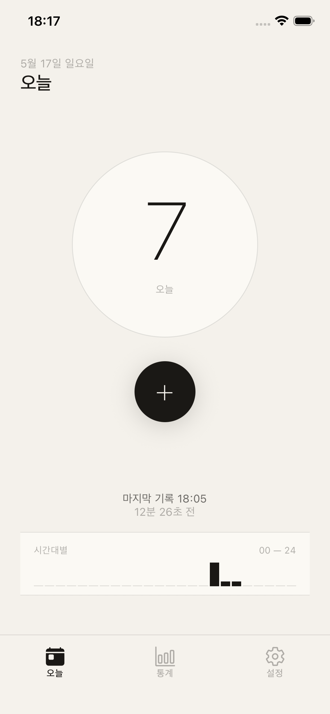
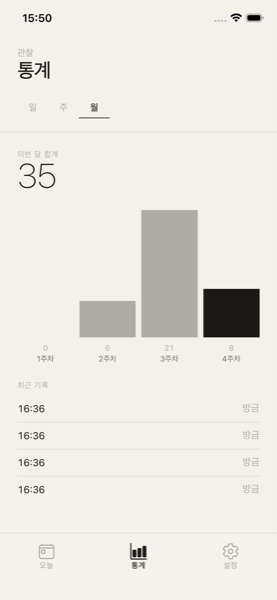

<div align="center">


# Smoke Tap

**One tap logs one smoke.**

No judgment, no goals to hit. Numbers are just numbers.


<br />

<table>
  <tr>
    <td align="center"><br /><sub><b>Today</b></sub></td>
    <td align="center"><br /><sub><b>Stats</b></sub></td>
    <td align="center"><br /><sub><b>Home Screen Widget</b></sub></td>
  </tr>
</table>

</div>

---

Designed to minimize friction. Open the app and tap the big button once, or tap the `+` button on the home screen widget once — done. The widget increments the count directly via App Intents without launching the app.

## ✦ Features

- **One-tap logging** — A single large button. If you tap by mistake, hit `Undo` on the toast to cancel the last entry.
- **Home screen widget** — iOS 17+ interactive widget. Logs without opening the app.
- **Local-first** — All data is stored on-device in `AsyncStorage`. No accounts, no server.
- **Minimal paper-texture UI** — Paper background texture with an ink color palette.
- **Stats** — Daily/weekly/monthly charts plus an hourly mini-graph.
- **No goals** — Smoke Tap does not set goals for you.

## ✦ Tech Stack

| Area | Tech |
|---|---|
| Runtime | Expo SDK 55 · React Native 0.83 · React 19.2 |
| Language | TypeScript (strict) |
| Routing | Expo Router (file-based, typed routes) |
| Styling | NativeWind v4 + StyleSheet |
| State | Zustand v5 (`persist` + AsyncStorage) |
| Widget | `expo-widgets` + Swift App Intents (iOS 17+) |
| Native bridge | Expo Modules (`SharedTapStore` App Group) |

## ✦ Getting Started

### Prerequisites

- macOS · Xcode 15+
- Node.js 20+ · npm
- iOS Simulator or an iOS 17+ device

### Install & Run

```bash
npm install
npm run prebuild:ios   # first time, or after any native code change
npm run ios            # build + run on simulator
```

> [!IMPORTANT]
> On a fresh clone, or after editing `app.json` / `plugins/` / `scripts/`, you must run `npm run prebuild:ios` first. Plain `expo prebuild` alone will drop the widget Swift or leave it stale.

### Dev Server Only

```bash
npm start              # Metro / Expo dev server
npx expo start --clear # clear Metro cache
```

## ✦ Commands

| Command | Purpose |
|---|---|
| `npm run ios` | Build + run on iOS simulator |
| `npm start` | Expo dev server only |
| `npm run prebuild:ios` | `expo prebuild --clean` then apply 3 patches in order |
| `npm run patch-widget` | Re-patch widget Swift only |
| `npx tsc --noEmit` | Type check (no test runner is configured) |

## ✦ Architecture

```
smoke-tap/
├── app/              Expo Router screens (tabs: index · stats · settings)
├── components/       UI (common · home · settings · stats)
├── store/            Zustand global state (useTapStore.ts)
├── modules/          Native module JS wrapper (SharedTapStore)
├── widgets/          Widget JSX (reference only — actual build is Swift in ios/)
├── plugins/          Expo config plugins
├── scripts/          Post-prebuild patch scripts
├── constants/        Design tokens (colors.ts)
├── i18n/             Korean locale
├── types/            Shared TypeScript types
└── ios/              Generated Xcode project (committed, do not edit by hand)
```

### Data Flow

1. **Tap in app** — `useTapStore.addTap()` pushes a `TapRecord` → persisted to AsyncStorage.
2. **Tap in widget** — A Swift App Intent increments the pending count in the App Group shared store `group.com.example.smoketap`.
3. **App focus** — `SharedTapStore.getPendingCount()` reads the accumulated count, merges it into records, then calls `clearPending()`.

### Widget Build Chain (Important)

After `expo prebuild --clean`, three patches **must be applied in this order** — `npm run prebuild:ios` handles all of them.

1. `scripts/patch-widget.js` — overwrites the widget Swift source.
2. `scripts/fix-build-phase-order.js` — reorders Build Phases so the patch Run Script fires **after** `[Expo] Configure project`.
3. `scripts/patch-expo-modules-provider.js` — regenerates `ExpoModulesProvider.swift`.

> [!WARNING]
> The App Group ID `group.com.example.smoketap` is hardcoded in three places: `app.json`, `plugins/withSharedTapStore.js`, and `scripts/patch-widget.js`. Changing it requires updating all three at once.

## ✦ Editing Rules

- Do not edit files under `ios/` directly — they are regenerated. Edit `app.json`, `plugins/`, or `scripts/` instead.
- `ios/Pods/` is likewise reinstalled on every `pod install`.
- For code style and guidelines, see [`CLAUDE.md`](CLAUDE.md) and [`.claude/guidelines.md`](.claude/guidelines.md).

## ✦ Platform

iOS only (`platforms: ["ios"]`). Android/Web builds are not configured.
The interactive home screen widget requires **iOS 17 or later** (App Intents).
