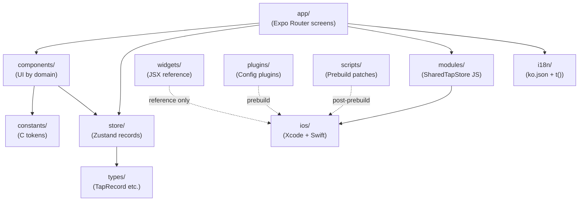
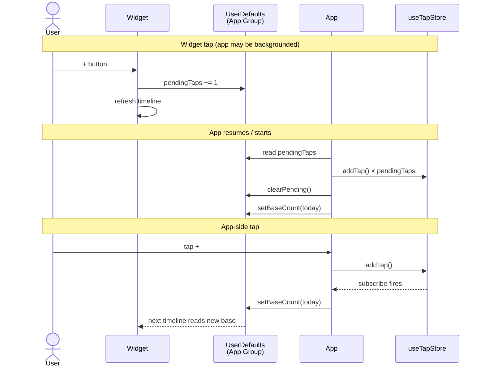

# AI-Readiness Foundation 6 Implementation Plan

> **For agentic workers:** REQUIRED SUB-SKILL: Use harness-flow:subagent-driven-development to implement this plan task-by-task. Steps use checkbox (`- [ ]`) syntax for tracking.

**Goal:** Bring smoke-tap from AI-Hostile (13/100) to AI-Assisted (≥70/100) by fixing referential trust, adding navigation/architecture/tribal-knowledge documents, and enforcing a path-validation gate via husky.

**Architecture:** Pure documentation + tooling work — no source code changes. 14 new/rewritten markdown docs, 1 Node validator script, husky pre-commit hook, package.json updates. Top-down sequence: build validator → fix root content → add supporting docs → cover modules → activate gate → re-measure.

**Tech Stack:** Node.js (validator, stdlib only), husky 9, markdown with mermaid blocks (rendered by most MD viewers).

**Reference:** Spec at `docs/harness-flow/specs/2026-05-10-ai-readiness-improvement-design.md`. Audit baseline at `docs/ai-readiness-score.json` and `docs/ai-readiness-map.html`.

---

## Project Conventions to Honor

- **Documentation language**: README.md in Korean (user global rule). All other context docs (CLAUDE.md, MEMORY.md, ARCHITECTURE.md, per-module CLAUDE.md) in English (Claude-facing convention).
- **Path style**: Repo-relative paths (e.g. `app/_layout.tsx`, not absolute). The validator resolves relative to the git root.
- **Module CLAUDE.md depth**: Tier 1 (action surface) = ~30 ln with Files/Patterns/Touch points/Gotchas sections. Tier 2 (resource) = ~10 ln pointer.
- **Compass-not-encyclopedia**: root CLAUDE.md should be 25–30 ln, deferring detail to subordinate docs.

---

## File Structure

| Status | Path | Responsibility |
|--------|------|----------------|
| Modify | `CLAUDE.md` | Compass: commands + module map + pointers |
| Modify | `README.md` | Public Korean README — what is smoke-tap, how to run |
| Create | `MEMORY.md` | Tribal knowledge with Why + How to apply |
| Create | `ARCHITECTURE.md` | Module deps + Widget↔App sync (mermaid) |
| Create | `app/CLAUDE.md` | Tier 1: routing, layout, tabs |
| Create | `components/CLAUDE.md` | Tier 1: component domains, design tokens |
| Create | `widgets/CLAUDE.md` | Tier 1: widget JSX vs Swift split |
| Create | `store/CLAUDE.md` | Tier 1: Zustand store, selectors |
| Create | `modules/CLAUDE.md` | Tier 1: native bridge JS wrapper |
| Create | `ios/CLAUDE.md` | Tier 1: Xcode project, App Group, widget extension |
| Create | `plugins/CLAUDE.md` | Tier 1: Expo config plugins |
| Create | `scripts/CLAUDE.md` | Tier 1: prebuild patches |
| Create | `constants/CLAUDE.md` | Tier 2: design tokens pointer |
| Create | `i18n/CLAUDE.md` | Tier 2: i18n pointer |
| Create | `types/CLAUDE.md` | Tier 2: shared types pointer |
| Create | `scripts/validate-context-paths.js` | Path validator (Node, stdlib only) |
| Create | `.husky/pre-commit` | Pre-commit hook calling validator |
| Modify | `package.json` | Add husky devDep + prepare + validate scripts |

---

## Task 1: Build the path validator (inert)

**Files:**

- Create: `scripts/validate-context-paths.js`

- [ ] **Step 1: Create the validator script with full implementation**

```javascript
#!/usr/bin/env node
/**
 * Validate that path-shaped tokens in context docs resolve to real files.
 *
 * Targets: CLAUDE.md, README.md, MEMORY.md, ARCHITECTURE.md, <module>/CLAUDE.md
 * Exits 0 if all paths exist, 1 otherwise.
 *
 * Skip a single line by placing `<!-- skip-validate-next -->` immediately above it.
 */

const fs = require('fs');
const path = require('path');

const ROOT = process.cwd();

const TOP_TARGETS = ['CLAUDE.md', 'README.md', 'MEMORY.md', 'ARCHITECTURE.md'];

const EXCLUDE_DIRS = new Set([
  'node_modules', '.git', '.expo', '.worktrees', '.claude',
  'ios', // includes Pods/build/etc.
]);

const SKIP_TOKEN_PATTERNS = [
  /^https?:\/\//,
  /^@\//,                     // TS path alias
  /^group\.com\./,            // App Group ID
  /[<>]/,                     // placeholder syntax
  /^[A-Z][a-zA-Z0-9_]*\.[A-Z]/, // identifier.IDENTIFIER (e.g. C.BG)
];

const KNOWN_EXTS = /\.(ts|tsx|js|jsx|json|md|yml|yaml|swift|png|jpg|jpeg|svg|css|html|sh|py|sql|plist|pbxproj|entitlements|h|m|mm|gradle|properties|xml|toml)$/i;

function findModuleClaudeMd(root) {
  const out = [];
  for (const entry of fs.readdirSync(root, { withFileTypes: true })) {
    if (!entry.isDirectory()) continue;
    if (EXCLUDE_DIRS.has(entry.name)) continue;
    if (entry.name.startsWith('.')) continue;
    const p = path.join(entry.name, 'CLAUDE.md');
    if (fs.existsSync(path.join(root, p))) out.push(p);
  }
  return out;
}

function looksLikePath(token) {
  if (token.length < 2 || token.length > 200) return false;
  if (/\s/.test(token)) return false;
  if (token.includes('/')) return true;
  return KNOWN_EXTS.test(token);
}

function shouldSkip(token) {
  return SKIP_TOKEN_PATTERNS.some((p) => p.test(token));
}

function pathExists(token) {
  const cleaned = token.replace(/[#?].*$/, '').replace(/\/$/, '');
  if (!cleaned) return true;
  return fs.existsSync(path.resolve(ROOT, cleaned));
}

function extractCandidates(line) {
  const out = new Set();
  for (const m of line.matchAll(/`([^`]+)`/g)) out.add(m[1]);
  for (const m of line.matchAll(/\[[^\]]*\]\(([^)\s]+)\)/g)) out.add(m[1]);
  for (const m of line.matchAll(/<code>([^<]+)<\/code>/g)) out.add(m[1]);
  return [...out];
}

const targets = [
  ...TOP_TARGETS.filter((f) => fs.existsSync(path.join(ROOT, f))),
  ...findModuleClaudeMd(ROOT),
];

const broken = [];

for (const target of targets) {
  const lines = fs.readFileSync(path.join(ROOT, target), 'utf8').split('\n');
  let skipNext = false;
  for (let i = 0; i < lines.length; i++) {
    const line = lines[i];
    if (/<!--\s*skip-validate-next\s*-->/.test(line)) { skipNext = true; continue; }
    if (skipNext) { skipNext = false; continue; }
    for (const c of extractCandidates(line)) {
      const t = c.trim();
      if (!looksLikePath(t)) continue;
      if (shouldSkip(t)) continue;
      if (!pathExists(t)) broken.push({ file: target, line: i + 1, token: t });
    }
  }
}

if (broken.length === 0) {
  console.log(`✓ All context paths resolve. (${targets.length} files checked)`);
  process.exit(0);
}

for (const b of broken) console.log(`${b.file}:${b.line}: ${b.token}`);
console.log(`\n✗ ${broken.length} broken path(s) across ${targets.length} files.`);
process.exit(1);
```

- [ ] **Step 2: Run baseline against current docs**

Run: `node scripts/validate-context-paths.js`

Expected: exit 1 with a list of broken paths. The list should overlap heavily with the audit's 26 reported broken paths from `docs/ai-readiness-score.json` (e.g. `services/mockApi.ts`, `app/_layout.ts`, `widgets/SmokeTapWidget.ts`). Exact count may differ slightly because the validator logic differs from the audit script — that's fine. Record the count for comparison after Phase 1.

- [ ] **Step 3: Quick sanity test — happy path token**

Run: `node -e "console.log(require('fs').existsSync('app/_layout.tsx'))"`

Expected: `true`. Confirms the validator's path resolution baseline.

- [ ] **Step 4: Commit the validator (not yet enforced)**

```bash
git add scripts/validate-context-paths.js
git commit -m "chore: add context-path validator (not yet enforced)"
```

---

## Task 2: Rewrite README.md (Korean, accurate)

**Files:**

- Modify: `README.md` (full rewrite — current content is stale boilerplate from a different project)

**Why:** Current README describes `services/mockApi.ts`, `community.tsx`, `profile.tsx`, `hooks/`, `5-tab definition` — none of which exist in smoke-tap. This is the largest single source of broken paths.

- [ ] **Step 1: Replace README.md with smoke-tap-accurate Korean content**

Structure (60–80 lines total):

```markdown
# Smoke Tap

흡연 한 번을 한 번의 가벼운 탭으로 기록하는 iOS 전용 앱.

판단 없이 자기 습관을 객관적으로 추적하고 싶은 사용자를 위해, **마찰 최소화**를 핵심 원칙으로 설계되었다. 홈 스크린 위젯에서도 한 번의 탭으로 바로 기록된다.

## Tech Stack

- Expo SDK 55 / React Native 0.83 / React 19.2
- TypeScript strict / Expo Router (file-based)
- NativeWind v4 + StyleSheet
- Zustand v5 (persist · AsyncStorage)
- expo-widgets + Swift App Intents (iOS 17+)

## 시작하기

### 1. 의존성 설치

\`\`\`bash
npm install
\`\`\`

### 2. iOS 시뮬레이터 실행

\`\`\`bash
npm run ios
\`\`\`

> 처음이거나 네이티브 코드 변경 후에는 prebuild 가 필요하다:
>
> \`\`\`bash
> npm run prebuild:ios
> \`\`\`
>
> 이 명령은 `expo prebuild --clean` 후 자동으로 widget patch · build phase 재정렬 · ExpoModulesProvider 패치를 순서대로 적용한다.

### 3. 개발 서버만 실행 (QR / Expo Go)

\`\`\`bash
npm start
\`\`\`

## 주요 명령어

| Command | Description |
|--------|------|
| `npm run ios` | iOS 시뮬레이터 빌드 + 실행 |
| `npm start` | Expo dev server 만 시작 |
| `npm run prebuild:ios` | prebuild + 3종 patch 자동 적용 |
| `npm run patch-widget` | widget Swift 파일만 재패치 |
| `npx tsc --noEmit` | 타입 체크 |
| `npx expo start --clear` | Metro 캐시 비우고 시작 |

## 디렉터리 구조 (요약)

\`\`\`
smoke-tap/
├── app/              # Expo Router (탭 3개: index · stats · settings)
├── components/       # UI 컴포넌트 (common · home · settings · stats)
├── widgets/          # 위젯 JSX (참조용, 실제 빌드는 Swift)
├── store/            # Zustand 전역 상태
├── modules/          # 네이티브 모듈 JS 래퍼
├── ios/              # 생성된 Xcode 프로젝트 (커밋됨)
├── plugins/          # Expo 커스텀 config plugin
├── scripts/          # prebuild 후 patch 스크립트
├── constants/        # 디자인 토큰 (`constants/colors.ts`)
├── i18n/             # 국제화 (`i18n/locales/ko.json`)
└── types/            # TypeScript 공유 타입
\`\`\`

상세는 [`ARCHITECTURE.md`](ARCHITECTURE.md) 참조.

## 더 읽을거리

- [`CLAUDE.md`](CLAUDE.md) — 에이전트/코드 작성용 컴파스
- [`ARCHITECTURE.md`](ARCHITECTURE.md) — 모듈 의존도 + 데이터 흐름
- [`MEMORY.md`](MEMORY.md) — 비명시 결정과 그 이유

## 플랫폼 / 버전

iOS 전용 (`platforms: ["ios"]`). 인터랙티브 위젯은 iOS 17 이상 필요 (App Intents).
```

**Important constraints**:
- Every backticked path must point to a real file/directory in this repo. Verified items so far: `app/`, `components/`, `widgets/`, `store/`, `modules/`, `ios/`, `plugins/`, `scripts/`, `constants/`, `i18n/`, `types/`, `i18n/locales/ko.json`, `constants/colors.ts`, `ARCHITECTURE.md` (will exist after T4), `CLAUDE.md`, `MEMORY.md` (will exist after T5), `package.json`.
- Forward references to docs that don't exist yet (`ARCHITECTURE.md`, `MEMORY.md`) MUST be added in this same task as empty placeholder files OR documented with `<!-- skip-validate-next -->` until T4/T5 land. Use the placeholder approach: create empty `MEMORY.md` and `ARCHITECTURE.md` with just a `# Title\n\nWIP — see plan.\n` body so that paths resolve. They will be filled in T4 and T5.

- [ ] **Step 2: Create empty placeholder docs that README forward-references**

Create `ARCHITECTURE.md`:

```markdown
# Architecture

WIP — populated in plan task 4.
```

Create `MEMORY.md`:

```markdown
# Memory

WIP — populated in plan task 5.
```

- [ ] **Step 3: Run the validator**

Run: `node scripts/validate-context-paths.js`

Expected: broken count drops sharply (most boilerplate-induced paths gone). README target: 0 broken.

- [ ] **Step 4: Commit**

```bash
git add README.md ARCHITECTURE.md MEMORY.md
git commit -m "docs: rewrite README in Korean for smoke-tap; stub MEMORY/ARCHITECTURE"
```

---

## Task 3: Compress root CLAUDE.md to a compass

**Files:**

- Modify: `CLAUDE.md` (123 → ~30 lines)

**Why:** Current file is an encyclopedia (Project Overview + Tech Stack + full Directory Structure + Core Architecture + Widget Sync details + Swift Code Generation + Design System + Conventions + Important Notes). Per "compass not encyclopedia": offload to README.md (project intro), ARCHITECTURE.md (structure + sync), MEMORY.md (Important Notes + Swift gen rationale), and per-module CLAUDE.md (domain detail).

- [ ] **Step 1: Replace CLAUDE.md with compass-style content**

Target structure (target ~30 lines):

```markdown
# CLAUDE.md

Smoke Tap — iOS-only one-tap smoke logger. Expo SDK 55 + React Native 0.83 + Expo Router + Zustand + iOS 17 widget (App Intents).

## Quick commands

| Command | What it does |
|--------|------|
| `npm run ios` | Build + run on iOS simulator |
| `npm start` | Dev server only |
| `npm run prebuild:ios` | `expo prebuild --clean` + 3-step native patch |
| `npm run patch-widget` | Re-apply widget Swift only |
| `npm run validate:context` | Validate context-doc paths (also runs in pre-commit) |
| `npx tsc --noEmit` | Type check |

## Module map

| Path | Role |
|------|------|
| `app/` | Expo Router (tabs: index · stats · settings) — see `app/CLAUDE.md` |
| `components/` | UI by domain (common · home · settings · stats) — see `components/CLAUDE.md` |
| `widgets/` | Widget JSX reference (Swift is authoritative) — see `widgets/CLAUDE.md` |
| `store/` | Zustand `useTapStore` (single source of truth) — see `store/CLAUDE.md` |
| `modules/` | Native bridge JS wrapper — see `modules/CLAUDE.md` |
| `ios/` | Generated Xcode project — see `ios/CLAUDE.md` |
| `plugins/` | Expo config plugins — see `plugins/CLAUDE.md` |
| `scripts/` | Prebuild patches — see `scripts/CLAUDE.md` |
| `constants/`, `i18n/`, `types/` | Resources — see each `CLAUDE.md` |

## Where to look next

- `README.md` — project intro, run instructions (Korean)
- `ARCHITECTURE.md` — module dependency + Widget↔App sync diagram
- `MEMORY.md` — non-obvious rules: prebuild patch rationale, App Group sync, iOS 17+ requirement
- Per-module `CLAUDE.md` for editing patterns and gotchas

## Conventions

- Comments / commits / identifiers in English. User-facing strings + README in Korean.
- TypeScript strict; minimize `as` casts.
- Path alias `@/*` → project root.
- Dates compared as `YYYY-MM-DD` strings in **device local timezone** (no UTC).
```

**Important constraints**:
- Every path mentioned must exist NOW or be created in a later task in this plan. Per-module CLAUDE.md files (`app/CLAUDE.md` etc.) don't exist yet — they'll land in T6/T7/T8. Two options to keep validator green:
  1. Skip per-module path mentions until T6–T8, then add them back. Awkward.
  2. Create empty stub `<module>/CLAUDE.md` files in this task too. Recommended — same pattern as T2's stubs for ARCHITECTURE.md / MEMORY.md.

- [ ] **Step 2: Create empty stub CLAUDE.md in each module CLAUDE.md will inhabit**

Create stubs for the 11 modules listed:

```bash
for m in app components widgets store modules ios plugins scripts constants i18n types; do
  printf '# %s/CLAUDE.md\n\nWIP — populated in plan task 6/7/8.\n' "$m" > "$m/CLAUDE.md"
done
```

- [ ] **Step 3: Run the validator on the full set**

Run: `node scripts/validate-context-paths.js`

Expected: 0 broken across all targets (all paths now resolve to either real files or stub CLAUDE.md). If any remain, inspect and fix.

- [ ] **Step 4: Commit**

```bash
git add CLAUDE.md app/CLAUDE.md components/CLAUDE.md widgets/CLAUDE.md store/CLAUDE.md modules/CLAUDE.md ios/CLAUDE.md plugins/CLAUDE.md scripts/CLAUDE.md constants/CLAUDE.md i18n/CLAUDE.md types/CLAUDE.md
git commit -m "docs: compress root CLAUDE.md to compass; stub per-module CLAUDE.md"
```

---

## Task 4: Write ARCHITECTURE.md

**Files:**

- Modify: `ARCHITECTURE.md` (replaces stub from T2)

- [ ] **Step 1: Replace ARCHITECTURE.md with full content**

Structure:

````markdown
# Architecture

## Module dependency



## Single Source of Truth

`store/useTapStore.ts` holds `records: TapRecord[]`. All statistics — `getTodayCount`, `getDailyStats`, `getWeeklyStats` — are pure selectors over this array. Do not introduce parallel caches or counters.

## Widget ↔ App synchronization

Two integer keys in `UserDefaults` under App Group `group.com.example.smoketap`:

- `pendingTaps` — taps made via the widget that the app has not yet absorbed
- `baseTodayCount` — today's count as known by the app (display reference for the widget)



## Swift code generation surface

Three Swift code paths land in `ios/` at prebuild time:

| Output | Source | Trigger |
|--------|--------|---------|
| Main app modules (`SharedTapStoreMainApp.swift`, `SharedTapStoreModule.swift`) | `plugins/withSharedTapStore.js` | `expo prebuild` |
| Widget targets (`SharedTapStore.swift`, `RecordTapIntent.swift`, `SmokeTapWidget.swift`) | `scripts/patch-widget.js` (overwrites expo-widgets defaults) | After prebuild |
| Build phase order in `SmokeTap` target | `scripts/fix-build-phase-order.js` | After prebuild |
| `ExpoModulesProvider.swift` (regenerated each build) | `scripts/patch-expo-modules-provider.js` | Defensive: after prebuild + as Run Script Build Phase |

Why post-prebuild patches and ordering matter is in `MEMORY.md`.

## Design system

Single light theme — paper tone + ink. Tokens in `constants/colors.ts` (`C.BG`, `C.CARD`, `C.INK`). Hierarchy: numbers are the hero. The home circular display is the focal point. Decoration restraint applies — only render UI explicitly in the design spec.
````

- [ ] **Step 2: Run the validator**

Run: `node scripts/validate-context-paths.js`

Expected: 0 broken. All Swift filenames mentioned exist either as real files in `ios/` or are explicitly listed as generated outputs (script's path heuristic skips Swift filenames inside table cells without leading `./` — but if the validator flags `SharedTapStore.swift` etc., add `<!-- skip-validate-next -->` markers above the rows that name not-yet-generated files in a clean checkout).

- [ ] **Step 3: Commit**

```bash
git add ARCHITECTURE.md
git commit -m "docs: add ARCHITECTURE.md with module deps + widget sync mermaid"
```

---

## Task 5: Write MEMORY.md

**Files:**

- Modify: `MEMORY.md` (replaces stub from T2)

- [ ] **Step 1: Replace MEMORY.md with structured tribal knowledge**

Structure — 6 entries, each `Rule + Why + How to apply`:

```markdown
# Memory

Non-obvious rules, decisions, and constraints. Each entry: **Rule**, **Why** (motivation/incident), **How to apply** (when this kicks in).

---

## Build pipeline: prebuild requires three follow-up patches

**Rule:** After every `expo prebuild`, three patches must run in order: `scripts/patch-widget.js` → `scripts/fix-build-phase-order.js` → `scripts/patch-expo-modules-provider.js`. Use `npm run prebuild:ios` so the wrapper handles ordering.

**Why:** `expo-widgets` overwrites widget Swift sources during prebuild, so we re-overwrite immediately after. The `[Expo] Configure project` build phase regenerates `ExpoModulesProvider.swift` on every build, so the Run Script Build Phase that calls our patch must come *after* it — and that ordering can only be enforced once the phase actually exists in `pbxproj` (i.e., post-prebuild).

**How to apply:** Never run plain `expo prebuild` directly. If you do, follow up with `npm run patch-widget` at minimum, plus the build phase reorder if pbxproj was regenerated.

---

## Widget Swift token sync is manual across three places

**Rule:** Color tokens used in the widget exist in three locations and must be kept in sync by hand: `constants/colors.ts`, the Swift string inside `scripts/patch-widget.js`, and the JSX in `widgets/SmokeTapWidget.tsx`.

**Why:** The widget runs as a separate iOS extension; it cannot import TypeScript modules. Swift code is the authoritative source for the actual build, but we keep the JSX in sync so changes are visible in code review and so the JSX serves as a compile-time reference.

**How to apply:** When changing any color used in the widget, update all three files in the same commit.

---

## App Group ID is duplicated in three configs

**Rule:** `group.com.example.smoketap` appears in `app.json`, `plugins/withSharedTapStore.js`, and `scripts/patch-widget.js`. All three must change together.

**Why:** Each file feeds a different stage of the build (Expo config / prebuild plugin / post-prebuild patch). There is no single source — the duplication is intentional to keep each stage independent.

**How to apply:** Renaming the App Group requires `grep -r "group.com.example.smoketap"` and editing every hit.

---

## Date comparisons use device local timezone

**Rule:** Dates are compared as `YYYY-MM-DD` strings in the device's local timezone. Never use UTC for comparisons. Follow the `toLocalDateString` pattern already in the codebase.

**Why:** "Today's count" must reflect the user's local day boundary. Using UTC creates off-by-one bugs at midnight in non-UTC zones.

**How to apply:** Any new selector or grouping logic on `TapRecord.timestamp` must convert to local date string before grouping.

---

## NativeWind v4 wiring is fragile and required

**Rule:** Two pieces are required for NativeWind to work: the `withNativeWind` wrapper in `metro.config.js`, and `import '../global.css'` at the top of `app/_layout.tsx`. Removing either breaks Tailwind class resolution silently.

**Why:** NativeWind v4 ties into the Metro bundler via the wrapper, and the runtime needs the CSS import to register class transforms. Both are easy to lose during refactors.

**How to apply:** When touching `metro.config.js` or `app/_layout.tsx`, preserve the NativeWind hooks.

---

## iOS 17+ is a hard requirement (App Intents)

**Rule:** Interactive widget buttons depend on App Intents, which require iOS 17 or higher. Push notifications are intentionally removed via `plugins/withRemovePushNotifications.js`.

**Why:** App Intents are the only way to trigger behavior from a widget tap without launching the app. Removing push notifications keeps the entitlement surface minimal.

**How to apply:** Do not lower the iOS deployment target below 17. To re-enable push notifications, modify or remove the plugin.
```

- [ ] **Step 2: Run the validator**

Run: `node scripts/validate-context-paths.js`

Expected: 0 broken.

- [ ] **Step 3: Commit**

```bash
git add MEMORY.md
git commit -m "docs: add MEMORY.md with 6 tribal-knowledge entries"
```

---

## Task 6: Tier 1 module CLAUDE.md — action surface (app, components, widgets)

**Files:**

- Modify: `app/CLAUDE.md`
- Modify: `components/CLAUDE.md`
- Modify: `widgets/CLAUDE.md`

**Template** (Tier 1, ~30 ln):

```markdown
# <module>/CLAUDE.md

<one-line module purpose>

## Files

- `<filename>` — <what it does>
...

## Patterns

- <pattern 1>
- <pattern 2>

## Touch points

- <other module/file that this co-changes with>

## Gotchas

- <non-obvious constraint>
```

- [ ] **Step 1: Replace `app/CLAUDE.md`**

```markdown
# app/CLAUDE.md

Expo Router screens. File-based routing — file path is the route.

## Files

- `_layout.tsx` — root Stack + `useWidgetSync()` hook (absorbs widget pendingTaps on resume)
- `(tabs)/_layout.tsx` — tab definition (3 tabs)
- `(tabs)/index.tsx` — Home (number display + plus button)
- `(tabs)/stats.tsx` — Daily / weekly stats
- `(tabs)/settings.tsx` — Settings rows

## Patterns

- New screens go inside `(tabs)/` if tab-bound, otherwise as a sibling of `(tabs)`. Stack root is `_layout.tsx`.
- Screen-only components may live next to the screen file. Cross-screen UI goes to `components/<domain>/`.
- Always import `'../global.css'` indirectly via `_layout.tsx` — do not duplicate the import.

## Touch points

- `store/useTapStore.ts` — most screens read selectors here.
- `modules/SharedTapStore.ts` — `_layout.tsx` calls into it via `useWidgetSync`.
- `i18n/` — user-facing strings.

## Gotchas

- The `useWidgetSync` hook in `_layout.tsx` runs on every app foreground; do not gate it behind navigation events.
- Tab labels are also user-facing — wire through `i18n/`.
```

- [ ] **Step 2: Replace `components/CLAUDE.md`**

```markdown
# components/CLAUDE.md

UI components grouped by domain. Each domain folder is screen-aligned, except `common/`.

## Files

- `common/AppHeader.tsx`, `common/PaperBackground.tsx` — used across all screens
- `home/CountDisplay.tsx`, `home/PlusButton.tsx`, `home/UndoToast.tsx`, `home/HourlyMini.tsx`
- `settings/Row.tsx`, `settings/Section.tsx`
- `stats/BarChart.tsx`

## Patterns

- New shared component → `common/`. Screen-exclusive component that won't be reused → `app/<screen>` (alongside the screen) or `components/<screen-domain>/`.
- All colors come from `constants/colors.ts` (`C.BG`, `C.INK`, etc.). No hardcoded hex.
- Wrap full-screen views with `<PaperBackground>` to apply the paper grain texture.

## Touch points

- `constants/colors.ts` — design tokens.
- `store/useTapStore.ts` — direct subscription via Zustand selectors when needed.

## Gotchas

- Numbers (count display) are the visual focal point — do not add competing accent colors. Single ink accent only.
- Decoration restraint: render only what the design spec calls for, even if a component is a stub.
```

- [ ] **Step 3: Replace `widgets/CLAUDE.md`**

```markdown
# widgets/CLAUDE.md

iOS Home Screen Widget — JSX in this folder is **reference only**. Actual widget UI is Swift, embedded as a string in `scripts/patch-widget.js`.

## Files

- `SmokeTapWidget.tsx` — JSX mirror of the Swift widget. Pre-existing TS errors here are expected (the file is reference-only).

## Patterns

- Any visual change to the widget requires editing **both** `widgets/SmokeTapWidget.tsx` (for review legibility) and the Swift string `SMOKE_TAP_WIDGET` inside `scripts/patch-widget.js` (authoritative source).
- After editing, run `npm run patch-widget` to re-apply the Swift to `ios/`.

## Touch points

- `scripts/patch-widget.js` — authoritative Swift source.
- `constants/colors.ts` — token table that must match the Swift hex literals.
- `plugins/withSharedTapStore.js` — registers the widget extension target.

## Gotchas

- `expo-widgets` will overwrite the Swift file during `expo prebuild`. Always run `npm run prebuild:ios` (which re-patches) instead of bare prebuild.
- Token sync is manual across three files — see `MEMORY.md` "Widget Swift token sync".
- Interactive widget buttons require iOS 17+ (App Intents).
```

- [ ] **Step 4: Run the validator**

Run: `node scripts/validate-context-paths.js`

Expected: 0 broken.

- [ ] **Step 5: Commit**

```bash
git add app/CLAUDE.md components/CLAUDE.md widgets/CLAUDE.md
git commit -m "docs: write Tier-1 CLAUDE.md for app, components, widgets"
```

---

## Task 7: Tier 1 module CLAUDE.md — data + native (store, modules, ios, plugins, scripts)

**Files:**

- Modify: `store/CLAUDE.md`
- Modify: `modules/CLAUDE.md`
- Modify: `ios/CLAUDE.md`
- Modify: `plugins/CLAUDE.md`
- Modify: `scripts/CLAUDE.md`

- [ ] **Step 1: Replace `store/CLAUDE.md`**

```markdown
# store/CLAUDE.md

Zustand v5 + persist (AsyncStorage). Single source of truth for tap records.

## Files

- `useTapStore.ts` — store definition with `records: TapRecord[]` plus actions and selectors

## Patterns

- All statistics derive from `records` via selectors (`getTodayCount`, `getDailyStats`, `getWeeklyStats`). Do not add parallel counters or caches.
- New persisted fields require a migration consideration — Zustand's `persist` versions are key.
- Actions: `addTap()`, `removeTap()`, `clearPending()`, `setBaseCount()` — keep them small and synchronous.

## Touch points

- `types/tap.ts` — `TapRecord`, `DailyStat`, `WeeklySummary`.
- `modules/SharedTapStore.ts` — pendingTaps absorption flows back into `addTap`.
- `app/_layout.tsx` — subscribes via `useTapStore.subscribe` to push base count to the widget.

## Gotchas

- Date selectors compare as `YYYY-MM-DD` in **device local timezone**, not UTC. Follow the existing `toLocalDateString` pattern.
```

- [ ] **Step 2: Replace `modules/CLAUDE.md`**

```markdown
# modules/CLAUDE.md

JavaScript wrapper for the `SharedTapStore` Expo Module (Swift-implemented). Exposes pending-tap counters and base-count writes from JS.

## Files

- `SharedTapStore.ts` — typed JS interface (`getPendingTaps`, `clearPending`, `setBaseCount`, `getBaseCount`)

## Patterns

- This module wraps a native Swift module produced by `plugins/withSharedTapStore.js` at prebuild time.
- API stays intentionally small: read/clear pending counter, write base today count. No business logic here.

## Touch points

- `plugins/withSharedTapStore.js` — generates the Swift counterpart.
- `store/useTapStore.ts` — caller during widget sync.
- `app/_layout.tsx` — invokes `useWidgetSync` which uses these methods.

## Gotchas

- Calling these on Android is unsupported (`platforms: ["ios"]` in `app.json`). The native module is iOS-only.
- After changing the Swift signatures via the plugin, `npm run prebuild:ios` is required to regenerate.
```

- [ ] **Step 3: Replace `ios/CLAUDE.md`**

```markdown
# ios/CLAUDE.md

Generated Xcode project (committed to repo). Contains the main `SmokeTap` app target and the widget extension.

## Files

- `SmokeTap.xcodeproj/` — project file (regenerated by prebuild)
- `SmokeTap/` — main app sources (Info.plist, AppDelegate, generated Swift modules)
- `SmokeTapWidget/` — widget extension target
- `Pods/` — CocoaPods install (do not edit by hand)

## Patterns

- Treat `ios/` as a build artifact — most edits should originate from `app.json`, `plugins/`, or `scripts/`. Direct edits will be lost on `expo prebuild --clean`.
- The `SmokeTap` target's build phases include a Run Script that calls `scripts/patch-expo-modules-provider.js`. Order matters — see `MEMORY.md`.

## Touch points

- `plugins/withSharedTapStore.js` — writes `SharedTapStoreMainApp.swift` and `SharedTapStoreModule.swift` into the main target.
- `scripts/patch-widget.js` — overwrites widget Swift after prebuild.
- `scripts/fix-build-phase-order.js` — reorders the patch phase to run after `[Expo] Configure project`.
- `app.json` — App Group ID, bundle identifiers, deployment target.

## Gotchas

- Editing files under `Pods/` is futile — they are reinstalled on every `pod install`.
- App Group ID `group.com.example.smoketap` must match `app.json`, `plugins/withSharedTapStore.js`, and `scripts/patch-widget.js`.
```

- [ ] **Step 4: Replace `plugins/CLAUDE.md`**

```markdown
# plugins/CLAUDE.md

Custom Expo config plugins that extend `expo prebuild`. Plugins run during prebuild and modify the generated native project.

## Files

- `withSharedTapStore.js` — writes main-app Swift modules and registers them in the Xcode target
- `withRemovePushNotifications.js` — strips push-notification permissions/entitlements

## Patterns

- A plugin is a function `(config) => modifiedConfig`. Mutate config or call `withDangerousMod` to write files.
- Plugins are registered in `app.json` under `expo.plugins`. Order matters when plugins depend on each other.
- Anything generated by a plugin will be overwritten on each `expo prebuild --clean`.

## Touch points

- `scripts/` — post-prebuild patches that run after these plugins.
- `app.json` — plugin registration order.
- `ios/` — the build target where plugins write.

## Gotchas

- The plugin API runs before the build phase ordering can be enforced — that is why `scripts/fix-build-phase-order.js` exists post-prebuild.
- To re-enable push notifications, modify or remove `withRemovePushNotifications.js`. Do not delete the entitlements file by hand.
```

- [ ] **Step 5: Replace `scripts/CLAUDE.md`**

```markdown
# scripts/CLAUDE.md

Post-prebuild patches and one-off generators. Most run automatically via `npm run prebuild:ios`.

## Files

- `patch-widget.js` — overwrites widget Swift sources (`SharedTapStore.swift`, `RecordTapIntent.swift`, `SmokeTapWidget.swift`) after prebuild because `expo-widgets` regenerates them
- `fix-build-phase-order.js` — moves the patch Run Script Build Phase to run after `[Expo] Configure project` in the `SmokeTap` target's pbxproj
- `patch-expo-modules-provider.js` — patches `ExpoModulesProvider.swift`; runs as Run Script Build Phase + defensively after prebuild
- `gen-grain.js` — one-off: generates `assets/textures/paper-grain.png`
- `validate-context-paths.js` — validates path references in context docs (also pre-commit hook)

## Patterns

- New post-prebuild patches: add to `scripts/`, then thread into the `prebuild:ios` npm script in `package.json`.
- Each script is plain Node, stdlib only — no dependencies. Keep it that way to avoid bloating the install.

## Touch points

- `package.json` — `prebuild:ios` and `patch-widget` scripts call into here.
- `ios/` — the target of every patch.
- `plugins/` — the patches run *after* plugins; they exist precisely because plugin output is not enough.

## Gotchas

- Running plain `expo prebuild` skips these patches. Always go through `npm run prebuild:ios`.
- See `MEMORY.md` "Build pipeline" for why ordering is non-negotiable.
```

- [ ] **Step 6: Run the validator**

Run: `node scripts/validate-context-paths.js`

Expected: 0 broken. (Some Swift filenames mentioned in `ios/CLAUDE.md` and `scripts/CLAUDE.md` may not exist on a clean checkout pre-prebuild; if the validator flags them, add `<!-- skip-validate-next -->` markers above those lines.)

- [ ] **Step 7: Commit**

```bash
git add store/CLAUDE.md modules/CLAUDE.md ios/CLAUDE.md plugins/CLAUDE.md scripts/CLAUDE.md
git commit -m "docs: write Tier-1 CLAUDE.md for store, modules, ios, plugins, scripts"
```

---

## Task 8: Tier 2 pointer CLAUDE.md (constants, i18n, types)

**Files:**

- Modify: `constants/CLAUDE.md`
- Modify: `i18n/CLAUDE.md`
- Modify: `types/CLAUDE.md`

- [ ] **Step 1: Replace `constants/CLAUDE.md`**

```markdown
# constants/CLAUDE.md

Design tokens and global constants.

## Files

- `colors.ts` — `C` namespace: `C.BG`, `C.CARD`, `C.INK`, etc.

All colors used in the app must be sourced from `C`. The widget side keeps a parallel hex copy in `scripts/patch-widget.js` — see `MEMORY.md` "Widget Swift token sync".

→ Used by every component in `components/CLAUDE.md`.
```

- [ ] **Step 2: Replace `i18n/CLAUDE.md`**

```markdown
# i18n/CLAUDE.md

Custom i18n implementation. Currently Korean only.

## Files

- `index.ts` — `t(key)` helper
- `locales/ko.json` — translation table

User-facing strings must always go through `t()`. App-internal labels (debug logs, error messages for developers) stay English.

→ Loaded by screens in `app/CLAUDE.md`.
```

- [ ] **Step 3: Replace `types/CLAUDE.md`**

```markdown
# types/CLAUDE.md

Shared TypeScript types crossing module boundaries.

## Files

- `tap.ts` — `TapRecord`, `DailyStat`, `WeeklySummary`

Types specific to a single module live alongside that module. Only put types here when they are imported by two or more modules.

→ Source of truth for `store/CLAUDE.md` selectors.
```

- [ ] **Step 4: Run the validator**

Run: `node scripts/validate-context-paths.js`

Expected: 0 broken.

- [ ] **Step 5: Commit**

```bash
git add constants/CLAUDE.md i18n/CLAUDE.md types/CLAUDE.md
git commit -m "docs: write Tier-2 pointer CLAUDE.md for constants, i18n, types"
```

---

## Task 9: Add husky + npm scripts

**Files:**

- Modify: `package.json`

- [ ] **Step 1: Install husky as devDependency**

Run: `npm install --save-dev husky@9`

Expected: `package.json` and `package-lock.json` updated; husky 9.x added under `devDependencies`.

- [ ] **Step 2: Add `prepare` and `validate:context` scripts to package.json**

Edit `package.json`'s `scripts` block. Add two entries:

```json
{
  "scripts": {
    "start": "expo start",
    "android": "expo run:android",
    "ios": "expo run:ios",
    "web": "expo start --web",
    "prebuild:ios": "expo prebuild --platform ios --clean && node scripts/patch-widget.js && node scripts/fix-build-phase-order.js && node scripts/patch-expo-modules-provider.js",
    "patch-widget": "node scripts/patch-widget.js",
    "validate:context": "node scripts/validate-context-paths.js",
    "prepare": "husky"
  }
}
```

- [ ] **Step 3: Run prepare manually (initializes .husky/)**

Run: `npm run prepare`

Expected: creates `.husky/` directory with husky's internal scripts.

- [ ] **Step 4: Verify validate:context still works via npm**

Run: `npm run validate:context`

Expected: exit 0 with `✓ All context paths resolve.`

- [ ] **Step 5: Commit**

```bash
git add package.json package-lock.json .husky/
git commit -m "chore: add husky 9 + validate:context npm script"
```

---

## Task 10: Activate husky pre-commit hook

**Files:**

- Create: `.husky/pre-commit`

- [ ] **Step 1: Create the pre-commit hook**

Create `.husky/pre-commit` with content:

```sh
npm run validate:context
```

Make it executable:

Run: `chmod +x .husky/pre-commit`

- [ ] **Step 2: Verify the hook runs by attempting a sentinel commit**

Create a small sentinel change:

```bash
echo "" >> README.md
git add README.md
git commit -m "test: husky pre-commit hook"
```

Expected: pre-commit fires `npm run validate:context`. Output includes `✓ All context paths resolve.` and the commit succeeds.

- [ ] **Step 3: Revert the sentinel change**

```bash
git reset --soft HEAD~1
git restore --staged README.md
git checkout README.md
```

Expected: working tree clean, no test commit in history.

- [ ] **Step 4: Verify the hook blocks broken paths (negative test)**

Add a deliberately broken path to a transient file:

```bash
echo '`nonexistent/file.ts`' >> README.md
git add README.md
git commit -m "test: should fail" || echo "BLOCKED as expected"
```

Expected: pre-commit fails. Output contains `README.md:<line>: nonexistent/file.ts` and `✗ 1 broken path(s)`. The phrase `BLOCKED as expected` appears (the `||` handles the failure).

Then revert:

```bash
git restore --staged README.md
git checkout README.md
```

- [ ] **Step 5: Commit the hook itself**

```bash
git add .husky/pre-commit
git commit -m "chore: enable husky pre-commit context-path validation"
```

---

## Task 11: Re-run AI-readiness audit and capture new score

**Files:**

- Modify: `docs/ai-readiness-score.json`
- Modify: `docs/ai-readiness-map.html`

- [ ] **Step 1: Re-run the scoring script**

Run:

```bash
python3 ~/.claude/skills/ai-readiness-cartography/scripts/score.py /Users/WonjinSin/Documents/project/smoke-tap --json /Users/WonjinSin/Documents/project/smoke-tap/docs/ai-readiness-score.json
```

Expected: stdout shows updated total. Target: ≥ 70 / 100.

- [ ] **Step 2: Inspect the new JSON**

Run: `python3 -c "import json; d=json.load(open('docs/ai-readiness-score.json')); print(d['total'], d['grade']); print({k: v['score'] for k,v in d['categories'].items()})"`

Expected: total ≥ 70, grade `AI-Assisted` or `AI-Ready`. Categories roughly:
- A ≥ 13, B ≥ 14, C ≥ 14, D ≥ 11, E ≥ 7, F ≥ 5, G = 0.

If total is below 70, inspect each category's findings array and address the lowest. Common causes: extra long files (B), missing dependency sections in module CLAUDE.md (C, D).

- [ ] **Step 3: Update the HTML dashboard with the new score**

The HTML (`docs/ai-readiness-map.html`) was authored against the 13/100 baseline. Update its scores and grade in place:

- `score-hero .num` — replace `13` with new total
- `grade-badge` colors — switch from red to green/amber per grade
- 7 category bars — update each `score / max` with new values, change `bar-bad` to `bar-good`/`bar-warn` per ratio
- Mini-stats — replace `0 / 12` and `26 / 31` with new values
- "Top ROI Actions" panel — update list to reflect remaining gaps (e.g., evals/, god file split)

If full re-authoring is preferred, regenerate using the cartography skill's template.

- [ ] **Step 4: Commit final state**

```bash
git add docs/ai-readiness-score.json docs/ai-readiness-map.html
git commit -m "docs: re-measure AI-readiness — score is now <new-total>/100"
```

Replace `<new-total>` with the actual number.

---

## Self-Review Notes (in-plan)

- **Spec coverage**: every numbered objective in `2026-05-10-ai-readiness-improvement-design.md` maps to a task here:
  - Spec §2 산출물 → File Structure table + tasks 1–10 cover each artifact.
  - Spec §4 phases S1–S9 → tasks 1–11 (S1=T1, S2=T2, S3=T3, S4=T4, S5=T5, S6=T6+T7, S7=T8, S8=T9+T10, S9=T11).
  - Spec §5 validator design → Task 1 implementation matches all listed requirements (target globs, skip patterns, output format).
  - Spec §6 husky → Tasks 9 + 10.
  - Spec §7 edge cases → handled in validator code (Task 1) + skip-validate-next markers (referenced in T4, T7).
  - Spec §8 success criteria → Task 11 verifies score ≥ 70 + per-category targets.
- **No placeholders**: all steps have concrete commands or code blocks. The two transient `<new-total>` placeholders in T11 are intentionally filled at runtime by the implementer based on the actual measurement.
- **Type / name consistency**: validator script function names (`extractCandidates`, `looksLikePath`, `shouldSkip`, `pathExists`) and npm script names (`validate:context`, `prepare`) used consistently across T1, T9, T10.
